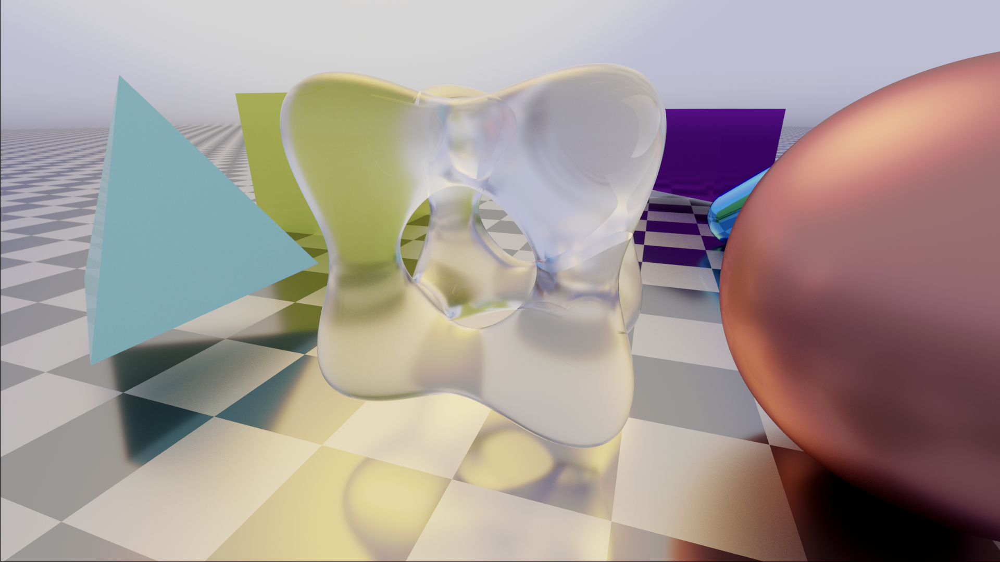

# Unity-Ray-Tracing-Primitives
WIP... but at least I converted [this shader](https://www.shadertoy.com/view/tl23Rm) by reinder on ShaderToy to study ray-tracing in order to make it compatible with Unity. 

